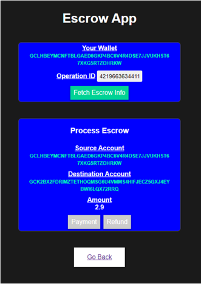

# Escrow System on Stellar Network

## 1. Workflow of Escrow system

### 1) Access site

Our system enables user to access through their web browser extension Stellar wallet(ex. Freighter), so that no cumbersome task for creating account/password is required to use our service.

### 2) Create Escrow account

By specifying buyer(sender) and seller(receiver) address of Stellar, new escrow account for these 2 parties will be created, and buyer should deposit specified amount of asset for receiver into this escrow account and share operation ID of this deposit transaction, which should be visible Stellar blockchain explorer.

### 3) Process Transaction

a) Load transaction information

In our system, both buyer and seller can see the transaction status by specifying operation ID which is created and shared in step 2.

b) Sign the transaction

Then each of them can sign(approve) either payment (to seller) or refund (to buyer) depending on actual trading situation.

If both parties approve payment or refund, this operation will be executed automatically by system. Otherwise, disputation happens, and escrow account agent must arbitrate bewteen them.

## 2. Technical Feature

### 1) Multi-sig Account

Escrow Account created by our system is 2 of 3 multi-sig account whose owner is buyer, sender, us(escrow agent). This can be confirmed on blockchain. Due to the nature of multi-sig account, users do not need to have full trust to us, because they can reject the transaction if escrow agent tried to move the fund in malicious way. So, this is trustless escrow system unlike escrow agent in traditional financial system.

### 2) Access control

Our system will be accessible through browser extension Stellar wallet, and user can only interact with the transactions related to his own address. 

